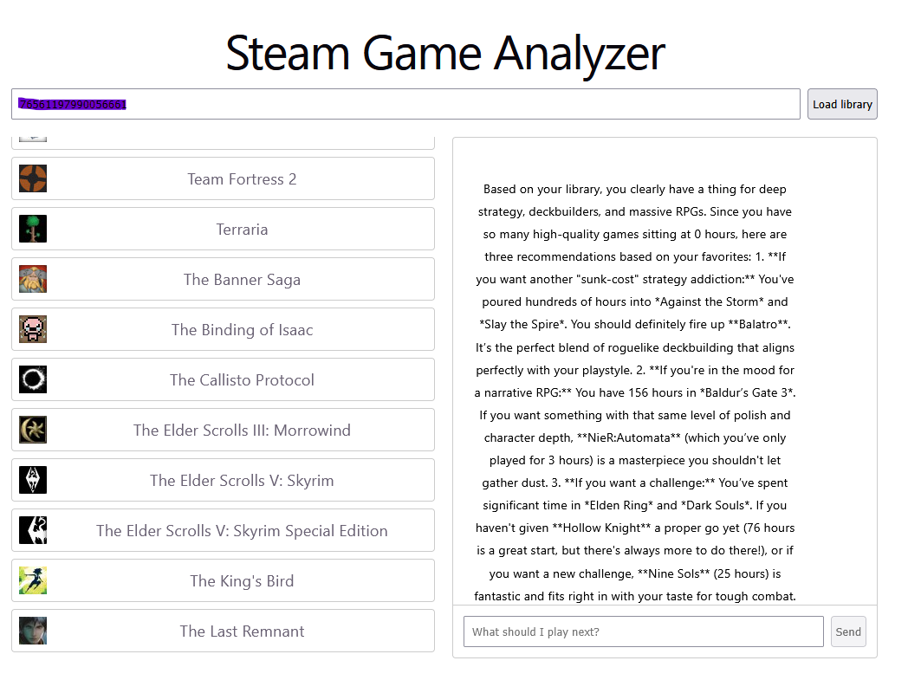

# Steam AI Recommendation

A conversational AI assitant that views your Steam game library through natural language.
Ask what to play next, find pattersn in your playtime or dig up forgotten games you own.

## Features

- Loads your full Steam library with playtime data
- Multi-turn conversation — ask follow-up questions naturally
- Sorted Alphabetically with game icons
- Powered by Google Gemini

## Tech Stack

- React + TypeScript (frontend)
- Node.js + Express (backend)
- Steam Web API
- Google Gemini API

## Getting Started

### Prerequisites

- Node.js 18+
- A [Steam API key](https://steamcommunity.com/dev/apikey)
- A [Gemini API key](https://aistudio.google.com)
- Your Steam profile set to **Public**

### Installation

1. Clone the repo
   git clone https://github.com/gdirk07/Steam-AI-Recommendation.git
   cd steam-analyzer

2. Install dependencies
   npm install

3. Set up environment variables
   create a .env in the root directory

   Fill in your keys in .env
  
   STEAM_API_KEY 
   VITE_GEMINI_API_KEY
   (optional) VITE_STEAM_ID (you can input your steam id manually, but if this exist it will do it for you)

  (optional) 

4. Run the app
   npm run dev

   Opens at http://localhost:5173

## Usage

1. Enter your Steam ID (found in your profile URL)
   (optional) you can instead create a variable in .env called VITE_STEAM_ID that contains it
2. Click Load library
3. Ask anything in the chat:
   - "What should I play next?"
   - "How many total hours have I played?"
   - "What's my most neglected game?"
   - "What genres do I play most?"

## How It Works

The backend fetches your Steam library via the Steam Web API and serves 
it to the frontend. When you send a message, your full game library is 
passed as context to Gemini alongside the conversation history, enabling 
it to answer questions specific to your collection across multiple turns.